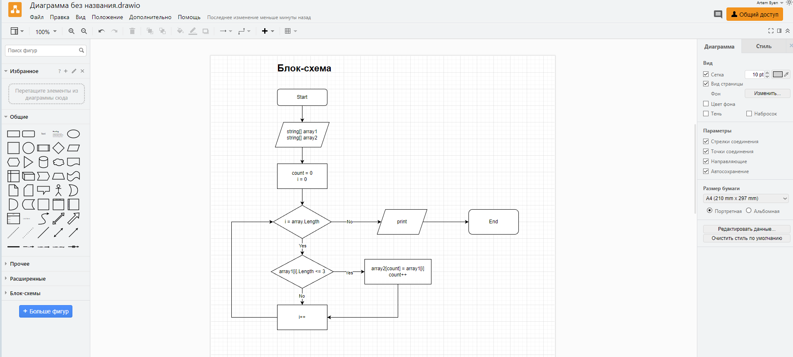

# Задача: 

Написать программу, которая из имеющегося массива строк формирует новый массив из строк, длина которых меньше, либо равна 3 символам. Первоначальный массив можно ввести с клавиатуры, либо задать на старте выполнения алгоритма. При решении не рекомендуется пользоваться коллекциями, лучше обойтись исключительно массивами.

# Решение задачи:

1. *Объявляем два массива.*

2. *Создаём метод "void":*
- используем цикл "for" и проверяем длинну массива;
- внути цикла "for" проверяем условие "<=3";
- если условие "<=3", то элемент первого массива заносим в "count" элемента второго массива;
- после присвоения увеличиваем переменную "count" на 1, т.е. "count++ (count = count + 1)"
- возвращаемся к циклу "for", где уже "i" увеличивается на 1 и всё повторяется до тех пор, пока не проверится всё

3. *Выводим результат.*
В итоге у нас формируется новый массив из строк, длина которых меньше, либо равна 3 символам

**Прикрепляю блок-схему:**

